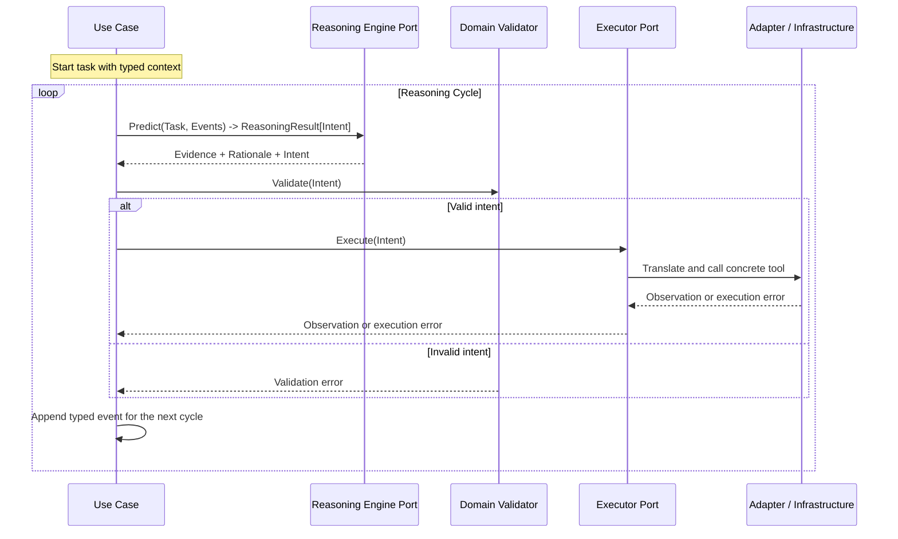

# Stoa Architecture

Stoa follows **Clean Architecture** and organizes code **by feature**. The goal is not to build a general agent framework. The goal is to make every agent loop explicit, typed, validated, and easy to inspect.

The central rule is simple:

```text
Infrastructure -> Interface Adapters -> Use Cases -> Domain
```

Dependencies point inward. The LLM SDK, database client, filesystem, shell, browser, and external APIs are infrastructure. Domain models must never import them.

## Core Principles

1. **Domain is the conscience.** Domain code owns entities, invariants, and validators.
2. **Use cases own the loop.** The agent cycle, retry policy, routing, feature prompts, and orchestration live in use case code.
3. **Adapters translate.** Provider message translation, output parsing, provider calls, and serialization live outside the use case boundary.
4. **Infrastructure executes.** Concrete SDKs, tools, databases, and operating-system calls are implementation details.
5. **Contracts are typed.** Agents exchange intents, observations, errors, and handoffs as Go types, not free-form text.

## Strategic Architecture View

Stoa combines Clean Architecture's inward dependency rule with Go's preference for feature-based packages.

```text
┌──────────────────────────────────────────────┐
│ Infrastructure                               │
│ SDKs, databases, files, external APIs        │
│  ┌────────────────────────────────────────┐  │
│  │ Interface Adapters                     │  │
│  │ Provider adapters, translation, codecs │  │
│  │  ┌──────────────────────────────────┐  │  │
│  │  │ Use Cases                        │  │  │
│  │  │ Agent loops and orchestration    │  │  │
│  │  │  ┌────────────────────────────┐  │  │  │
│  │  │  │ Domain                     │  │  │  │
│  │  │  │ Entities, rules, validators│  │  │  │
│  │  │  └────────────────────────────┘  │  │  │
│  │  └──────────────────────────────────┘  │  │
│  └────────────────────────────────────────┘  │
└──────────────────────────────────────────────┘
```

Dependencies point inward. Runtime calls can cross outward through interfaces, but source imports must not.

## Feature Slice Layout

Each feature spans two Go packages: a domain package and an agent package. The split keeps domain types independently importable so other agents, handoff receivers, or offline batch validators can consume them without pulling any LLM code.

```text
stoa/
  <domain>/             # Pure domain: entities, validators, ports, events
    <domain>.go         # Value types and validators (stdlib-only)
    <port>.go           # Port interface(s); ports are stdlib-only
    event.go            # Typed domain events when the feature is event-driven
    <domain>_test.go
  <agent>/              # Use case: the agent loop that operates on <domain>
    agent.go            # Orchestration (imports <domain>, llm, harness/loop)
    prompt.go           # Feature-specific provider-neutral PromptRenderer
    agent_test.go
    integration_test.go
  persistence/
    memory/             # In-memory repositories (test + dev default)
      memory.go         #   Package doc + any cross-domain helpers
      accounting.go     #   NewAccountingRepository factory
    <backend>/          # Production repositories (e.g. persistence/postgres)
      <backend>.go      #   Generic plumbing (pool, migrations, codec)
      accounting.go     #   NewAccountingRepository factory
  messaging/
    inproc/             # In-process EventBus (test + dev default)
      bus.go            #   Package doc
      accounting.go     #   NewAccountingBus factory
    <transport>/        # Production transports (e.g. messaging/nats)
      <transport>.go    #   Generic transport (connection, publish, drain)
      accounting.go     #   NewAccountingBus factory + domain codec
  harness/
    loop/               # Typed reason-validate-execute runner
    validator/          # Shared validation helpers and LLM feedback formatting
    retry/              # (reserved) retry and circuit-breaker mechanics
    handoff/            # (reserved) shared handoff envelopes
  llm/                  # Reasoning engine and message contracts
  llm/<provider>/       # Provider adapters (e.g. llm/openai)
  tools/                # Shared tool definitions
  cmd/                  # Executable entry points
  testdata/             # Notes, golden sets, evaluation fixtures
  docs/
```

Example: `icd/` defines ICD-10 `Note`, `Intent`, `Validator`, and the `Dictionary`/`Recorder` ports with their in-memory defaults. `coder/` is the clinical-coding agent that orchestrates the loop and renders the ICD-specific prompt. The OpenAI wiring happens at the composition edge, where `coder.PromptRenderer` is passed into `llm/openai`. `icd/` never imports `coder/` or `llm/`.

Outbound adapters -- persistence implementations, message-bus transports, HTTP clients, anything that pulls in an external SDK or network dependency -- do not live under the domain package. They go in the top-level `persistence/` and `messaging/` trees (or their own peer tree for a new category), each adapter in its own subpackage that imports the domain it implements but is not imported by it. For example, `accounting.LedgerRepository` is satisfied by `persistence/memory` (in-process default) and `persistence/postgres` (production, sqlc + pgx/v5); `bookkeeper.EventBus` (Publish + Subscribe + Close, defined alongside the agent in the use-case package because event delivery is orchestration rather than a business rule) is satisfied by `messaging/inproc` (in-process default) and `messaging/nats` (production, JetStream with `Nats-Expected-Last-Subject-Sequence` for optimistic concurrency). Both adapters return the interface from their constructors -- callers depend only on the abstraction. The composition edge -- `cmd/stoa` plus the `config` package -- picks which pair to wire at boot from a `config.yaml` (read from the stoa work directory selected by `--work-dir`, defaulting to `~/.flarex/stoa`; the file is required, no implicit in-process fallback). The domain remains stdlib-only.

Trivial in-process defaults that exist only to make ports usable without infrastructure (an in-memory map satisfying a repository port, a synchronous fan-out satisfying a publisher port) still live in the outbound tree, not in the domain root -- this keeps `go doc <domain>` focused on entities, invariants, and ports, and gives every adapter the same shape regardless of how heavy it is.

### Adapter convention: one file per domain

Each adapter package (`messaging/inproc`, `messaging/nats`, `persistence/memory`, `persistence/postgres`) follows the same two-file convention: a generic core file containing transport-level plumbing that imports no domain package, plus one `<domain>.go` file per domain that ships the typed factory function `New{Domain}{Port}(...) → domain.Port`. Concrete adapter structs stay unexported -- the only thing crossing the package boundary is the factory function returning the port interface, so cmd-time wiring never depends on the concrete type. When a second domain needs the same transport, it adds a sibling `{domain}.go` file rather than touching the core or any existing factory.

For genuinely thin adapters (`messaging/inproc`, `persistence/memory`), the "generic core" is just a package doc -- the in-process implementations are small enough that sharing infrastructure would cost more than it saves; each domain file owns its own state. For heavier adapters (`messaging/nats`, `persistence/postgres`), the core file holds the genuinely-shared plumbing: NATS connection / stream / consumer / drain lifecycle in the former, pgxpool plumbing in the latter.

Feature-based organization does not mean dependency rules disappear. The direction still flows inward through interfaces: the agent depends on domain, never the reverse. Cross-feature contracts, such as `llm.ReasoningEngine[TIntent]`, may live in shared packages when they are intentionally reusable across agents.

## The Stoa Cycle

Every agent follows the same cycle:

1. **Reason with evidence.** The LLM explains which supplied facts support its proposed intent.
2. **Emit structured intent.** The model outputs a typed intent, not an action.
3. **Validate in domain code.** Pure Go rules decide whether the intent is allowed.
4. **Execute through a port.** Use cases call an interface; infrastructure implements it. In the ICD example, validated intents are recorded through `icd.Recorder`.
5. **Feed back observations or errors.** Validation and execution results become typed context for the next cycle.



The important boundary is that the use case depends on `ReasoningEngine` and `Executor`-style interfaces, not on concrete SDKs or tool clients. A feature may also call domain ports directly when the port is itself a business concept, such as `icd.Recorder`.

## Ports, Not Infrastructure Dependencies

Use cases define the capabilities they need as narrow interfaces. Adapters implement those interfaces using infrastructure. If a port is useful across several features, it can live in a shared package; `llm.ReasoningEngine[TIntent]` is shared because the reasoning workflow is reusable while the intent type remains feature-owned.

```go
type ReasoningEngine[TIntent any] interface {
	Predict(ctx context.Context, input ReasoningInput) (ReasoningResult[TIntent], error)
}

type Executor[TIntent any] interface {
	Execute(ctx context.Context, intent TIntent) (Observation, error)
}
```

The domain does not know these interfaces exist unless they represent pure business concepts. Domain code should normally expose structs and validation methods, plus ports for domain-owned capabilities such as dictionaries, repositories, or recorders.

```go
type Intent struct {
	Symbol string
	Amount int
}

func (i Intent) Validate() error {
	if i.Symbol == "" {
		return errors.New("symbol is required")
	}
	if i.Amount <= 0 {
		return errors.New("amount must be positive")
	}
	return nil
}
```

## Reasoning Result Contract

"Reasoning with evidence" should be part of the contract, not just a prompt instruction.

```go
type ReasoningResult[TIntent any] struct {
	Evidence  []EvidenceRef
	Rationale string
	Intent    TIntent
}

type EvidenceRef struct {
	Source string
	Fact   string
}
```

`Rationale` should be concise and auditable. It is not a place to depend on hidden chain-of-thought. The contract should capture what a validator, test, or human reviewer can inspect.

## Cycle Events

Agent memory inside a loop should not be a raw `[]string`. Validation failures, execution failures, observations, and model outputs have different meanings.

```go
type CycleEvent struct {
	Role    EventRole
	Kind    EventKind
	Content string
}

const (
	EventModelOutput     EventKind = "model_output"
	EventValidationError EventKind = "validation_error"
	EventExecutionError  EventKind = "execution_error"
	EventObservation     EventKind = "observation"
)
```

Typed events make self-correction more reliable because the next reasoning step can distinguish "the model said this" from "the environment rejected this."

## Handoff Decision

Handoff has three responsibilities, and they belong in different layers:

| Responsibility | Layer | Why |
| --- | --- | --- |
| Handoff data contract | Domain or shared `harness/handoff` | It is the typed boundary between agents. |
| Handoff routing policy | Use case | Deciding when and where to hand off is orchestration. |
| Handoff serialization or transport | Adapter / Infrastructure | JSON, queues, HTTP, files, and SDK calls are external details. |

Do not turn handoff into a global framework or registry unless repeated features prove the need. Start with explicit typed contracts and small routing functions.

## Harness Responsibilities

`harness/` contains reusable mechanics, not business judgment.

Good harness responsibilities:

- Formatting validation errors for LLM feedback.
- Retry loops with bounded attempts.
- Circuit breakers and timeouts.
- Common event recording helpers.
- Shared handoff utilities when multiple features need the same envelope.

Bad harness responsibilities:

- Owning feature-specific business rules.
- Knowing concrete provider SDKs.
- Deciding which business intent is valid.
- Hiding the agent loop behind opaque middleware.

The rule of thumb is: **domain owns rules; harness owns mechanics**.

## Testing Expectations

Each feature should test the contract at multiple levels:

- Domain validator tests for business invariants.
- Use case loop tests with fake reasoning engines and fake executors.
- Adapter tests for prompt rendering, structured parsing, and infrastructure error mapping.
- Golden tests for representative reasoning cycles and correction behavior.

Validation and execution errors should be tested as first-class inputs, not only as failure cases.

## What This Architecture Prevents

This architecture is designed to prevent common agent failures:

- Domain models importing LLM SDKs or tool clients.
- Prompts becoming the only source of business rules.
- Free-form text handoffs between agents.
- Blind retries without new feedback.
- Framework-style magic hiding the actual loop.
- Provider-specific code leaking into use cases.

Stoa should stay small enough to read, but strict enough that invalid actions cannot slip through just because the model sounded confident.
