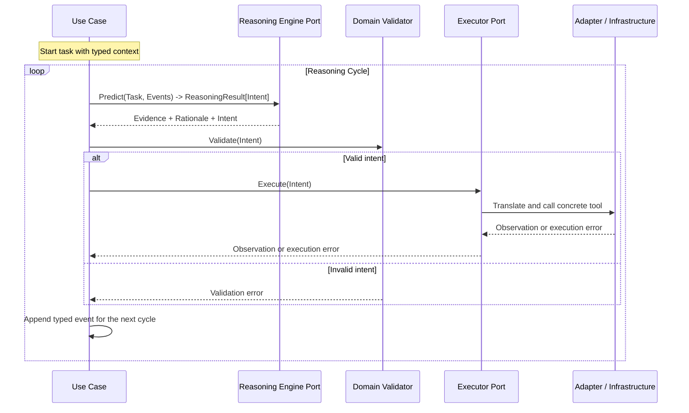

# Stoa Architecture

Stoa follows **Clean Architecture** and organizes code **by feature**. The goal is not to build a general agent framework. The goal is to make every agent loop explicit, typed, validated, and easy to inspect.

The central rule is simple:

```text
Infrastructure -> Interface Adapters -> Use Cases -> Domain
```

Dependencies point inward. The LLM SDK, database client, filesystem, shell, browser, and external APIs are infrastructure. Domain models must never import them.

## Core Principles

1. **Domain is the conscience.** Domain code owns entities, invariants, and validators.
2. **Use cases own the loop.** The agent cycle, retry policy, routing, and orchestration live in use case code.
3. **Adapters translate.** Prompt rendering, output parsing, provider calls, and serialization live outside the use case boundary.
4. **Infrastructure executes.** Concrete SDKs, tools, databases, and operating-system calls are implementation details.
5. **Contracts are typed.** Agents exchange intents, observations, errors, and handoffs as Go types, not free-form text.

## Strategic Architecture View

Stoa combines Clean Architecture's inward dependency rule with Go's preference for feature-based packages.

```mermaid
graph LR
    subgraph Infrastructure ["Infrastructure: SDKs, Tools, Storage"]
        Provider["LLM Provider SDK"]
        DB["Database / File System"]
        Tool["Shell / HTTP / Browser / APIs"]
    end

    subgraph Adapters ["Interface Adapters: Translation"]
        LLMAdapter["Reasoning Engine Adapter"]
        Prompt["Prompt Renderer"]
        Parser["Structured Output Parser"]
        ExecutorAdapter["Executor Adapter"]
    end

    subgraph UseCases ["Use Cases: Agent Loop"]
        Loop["Explicit Reason/Validate/Execute Loop"]
        Ports["Ports Defined As Interfaces"]
        Routing["Handoff Routing Policy"]
    end

    subgraph Domain ["Domain: Business Judgment"]
        Intent["Intent Types"]
        Rules["Validators and Invariants"]
        HandoffContract["Handoff Contracts"]
    end

    Infrastructure --> Adapters
    Adapters --> UseCases
    UseCases --> Domain

    style Domain fill:#f8b26a,stroke:#333,stroke-width:3px
```



## Feature Slice Layout

A feature is a self-contained Go package. It contains the domain types, use case flow, adapters, and tests needed for one agent or one agent capability.

```text
stoa/
  <feature_name>/
    domain.go       # Intent structs, handoff contracts, validation rules
    usecase.go      # The explicit agent loop and orchestration policy
    ports.go        # Interfaces required by the use case
    adapter.go      # Adapter implementations for prompts, parsers, tools, SDKs
    *_test.go
  harness/
    validator/      # Shared validation helpers and LLM feedback formatting
    retry/          # Retry and circuit-breaker mechanics
    handoff/        # Shared handoff helpers, if a contract crosses features
  llm/              # Shared reasoning engine interfaces
  tools/            # Shared tool definitions
  cmd/              # Executable entry points
  testdata/         # Golden sets and evaluation fixtures
  docs/
```

Feature-based organization does not mean dependency rules disappear. A feature may keep related files together, but the direction still flows inward through interfaces.

## The Stoa Cycle

Every agent follows the same cycle:

1. **Reason with evidence.** The LLM explains which supplied facts support its proposed intent.
2. **Emit structured intent.** The model outputs a typed intent, not an action.
3. **Validate in domain code.** Pure Go rules decide whether the intent is allowed.
4. **Execute through a port.** Use cases call an interface; infrastructure implements it.
5. **Feed back observations or errors.** Validation and execution results become typed context for the next cycle.



The important boundary is that the use case depends on `ReasoningEngine` and `Executor` interfaces, not on concrete SDKs or tool clients.

## Ports, Not Infrastructure Dependencies

Use cases define the capabilities they need as narrow interfaces. Adapters implement those interfaces using infrastructure.

```go
type ReasoningEngine[TIntent any] interface {
	Predict(ctx context.Context, input ReasoningInput) (ReasoningResult[TIntent], error)
}

type Executor[TIntent any] interface {
	Execute(ctx context.Context, intent TIntent) (Observation, error)
}
```

The domain does not know these interfaces exist unless they represent pure business concepts. Domain code should normally expose structs and validation methods only.

```go
type Intent struct {
	Symbol string
	Amount int
}

func (i Intent) Validate() error {
	if i.Symbol == "" {
		return errors.New("symbol is required")
	}
	if i.Amount <= 0 {
		return errors.New("amount must be positive")
	}
	return nil
}
```

## Reasoning Result Contract

"Reasoning with evidence" should be part of the contract, not just a prompt instruction.

```go
type ReasoningResult[TIntent any] struct {
	Evidence  []EvidenceRef
	Rationale string
	Intent    TIntent
}

type EvidenceRef struct {
	Source string
	Fact   string
}
```

`Rationale` should be concise and auditable. It is not a place to depend on hidden chain-of-thought. The contract should capture what a validator, test, or human reviewer can inspect.

## Cycle Events

Agent memory inside a loop should not be a raw `[]string`. Validation failures, execution failures, observations, and model outputs have different meanings.

```go
type CycleEvent struct {
	Role    EventRole
	Kind    EventKind
	Content string
}

const (
	EventModelOutput     EventKind = "model_output"
	EventValidationError EventKind = "validation_error"
	EventExecutionError  EventKind = "execution_error"
	EventObservation     EventKind = "observation"
)
```

Typed events make self-correction more reliable because the next reasoning step can distinguish "the model said this" from "the environment rejected this."

## Handoff Decision

Handoff has three responsibilities, and they belong in different layers:

| Responsibility | Layer | Why |
| --- | --- | --- |
| Handoff data contract | Domain or shared `harness/handoff` | It is the typed boundary between agents. |
| Handoff routing policy | Use case | Deciding when and where to hand off is orchestration. |
| Handoff serialization or transport | Adapter / Infrastructure | JSON, queues, HTTP, files, and SDK calls are external details. |

Do not turn handoff into a global framework or registry unless repeated features prove the need. Start with explicit typed contracts and small routing functions.

## Harness Responsibilities

`harness/` contains reusable mechanics, not business judgment.

Good harness responsibilities:

- Formatting validation errors for LLM feedback.
- Retry loops with bounded attempts.
- Circuit breakers and timeouts.
- Common event recording helpers.
- Shared handoff utilities when multiple features need the same envelope.

Bad harness responsibilities:

- Owning feature-specific business rules.
- Knowing concrete provider SDKs.
- Deciding which business intent is valid.
- Hiding the agent loop behind opaque middleware.

The rule of thumb is: **domain owns rules; harness owns mechanics**.

## Testing Expectations

Each feature should test the contract at multiple levels:

- Domain validator tests for business invariants.
- Use case loop tests with fake reasoning engines and fake executors.
- Adapter tests for prompt rendering, structured parsing, and infrastructure error mapping.
- Golden tests for representative reasoning cycles and correction behavior.

Validation and execution errors should be tested as first-class inputs, not only as failure cases.

## What This Architecture Prevents

This architecture is designed to prevent common agent failures:

- Domain models importing LLM SDKs or tool clients.
- Prompts becoming the only source of business rules.
- Free-form text handoffs between agents.
- Blind retries without new feedback.
- Framework-style magic hiding the actual loop.
- Provider-specific code leaking into use cases.

Stoa should stay small enough to read, but strict enough that invalid actions cannot slip through just because the model sounded confident.
