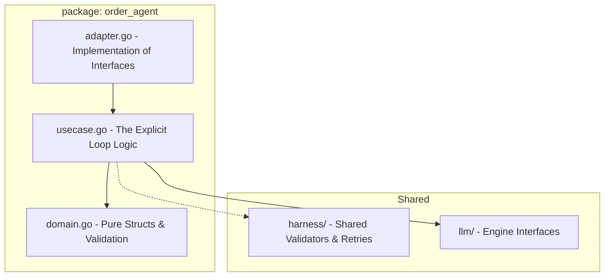
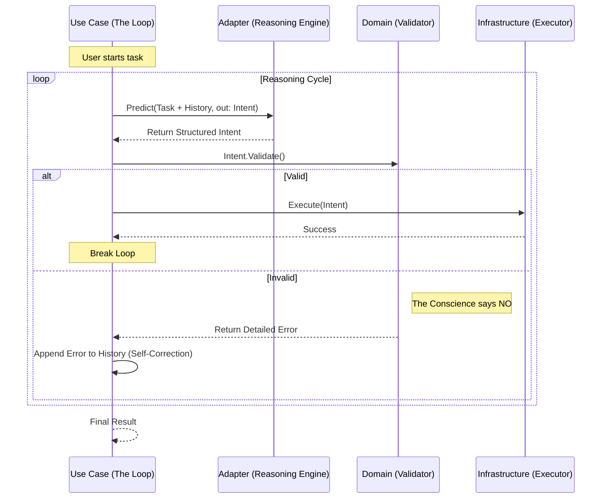

# Stoa Architecture

Stoa follows **Clean Architecture** principles, prioritizing the separation of concerns and ensuring that business logic remains independent of external frameworks and infrastructure.

## Core Principles
1. **Inward Dependencies**: Dependencies only point toward the inner layers (Domain).
2. **Independent of Frameworks**: The core logic doesn't depend on LLM SDKs or databases.
3. **Feature-Based Organization**: Code is grouped by business feature rather than technical layer.

## Strategic Architecture View

The following diagram illustrates how Stoa balances **Clean Architecture** (the concentric circles) with **Feature-based Organization** (the vertical slices).

```mermaid
graph LR
    %% Definition of Layers
    subgraph Infrastructure_Layer ["Infrastructure (Outer - Tools & SDKs)"]
        direction TB
        SDK[LLM Providers]
        DB[(PostgreSQL/File)]
        OS[Terminal/OS]
    end

    subgraph Adapter_Layer ["Adapters (Translation)"]
        direction TB
        LLM[LLM Engines]
        Prompts[Prompt Templates]
        Parsers[Output Parsers]
    end

    subgraph UseCase_Layer ["Use Cases (The Loop)"]
        direction TB
        Logic[Explicit Agent Loop]
        Orch[Handoff Logic]
    end

    subgraph Domain_Layer ["Domain (The Conscience)"]
        direction TB
        Entity[Pure Intent Structs]
        Rules[Explicit Validators]
    end

    %% Dependency Flow (Inward)
    Infrastructure_Layer -.-> Adapter_Layer
    Adapter_Layer -.-> UseCase_Layer
    UseCase_Layer -.-> Domain_Layer

    style Domain_Layer fill:#f96,stroke:#333,stroke-width:4px
```



## Implementation Pattern (The Feature Slice)

In Stoa, a "Feature" is a self-contained Go package. We avoid global registries or complex middleware chains.



## The Explicit Loop (Data Flow)

This is the heartbeat of a Stoa Agent. It's not a framework hidden in a library, but an explicit `for` loop in the Use Case.



## Why this is "Better":
1.  **Framework-Free**: We use standard Go patterns. No `init()` magic, no reflection-heavy registries.
2.  **Explicit Errors**: Validation errors are treated as **First-Class Inputs** for the LLM.
3.  **Traceable**: Since the loop is in the Use Case, you can easily log every single "thought" and "correction" without digging through middleware layers.

## Layers Description

| Layer | Responsibility | Content |
| :--- | :--- | :--- |
| **Domain** | The heart of the application. Contains pure business logic. | Structs, Invariants, Validators. |
| **Use Cases** | Coordinates the flow of data to and from the domain. | Agent loop logic, Task sequences. |
| **Adapters** | Translates data between the internal and external world. | LLM client implementations, Prompt formatting. |
| **Infrastructure** | Concrete implementations of external tools. | SDK calls, DB queries, File system. |

## Feature-based Layout
Unlike traditional Clean Architecture implementations that use top-level layer folders, Stoa organizes code by feature:

```text
stoa/
├── <feature_name>/
│   ├── domain.go      # Entities & Rules
│   ├── usecase.go     # Task Flow
│   ├── adapter.go     # LLM / DB Implementation
│   └── *_test.go
├── harness/           # Cross-cutting concerns (Validation, Retry)
└── llm/               # Shared LLM abstractions
```

---
**Discussion Point**: In this architecture, where should we place the "Handoff" logic between agents? Should it be a shared Domain entity or a specific Use Case service?
