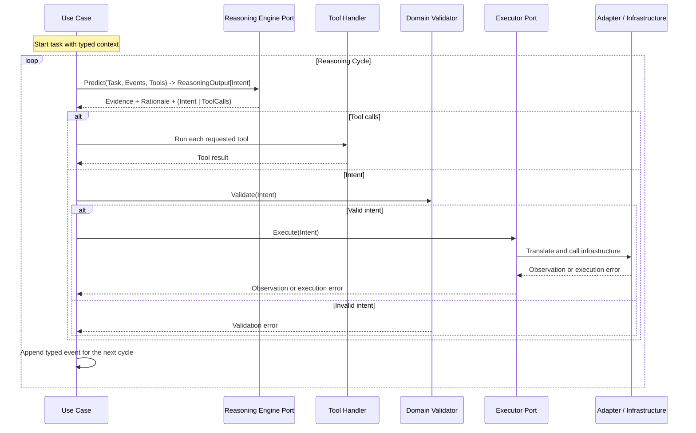

# Stoa Architecture

Stoa follows **Clean Architecture** and organizes code **by feature**. The goal is not to build a general agent framework. The goal is to make every agent loop explicit, typed, validated, and easy to inspect.

The central rule is simple:

```text
Infrastructure -> Interface Adapters -> Use Cases -> Domain
```

Dependencies point inward. The LLM SDK, database client, filesystem, shell, browser, and external APIs are infrastructure. Domain models must never import them.

## Core Principles

1. **Domain is the conscience.** Domain code owns entities, invariants, and validators.
2. **Use cases own the loop.** The agent cycle, retry policy, routing, feature prompts, and orchestration live in use case code.
3. **Adapters translate.** Provider message translation, output parsing, provider calls, and serialization live outside the use case boundary.
4. **Infrastructure executes.** Concrete SDKs, tools, databases, and operating-system calls are implementation details.
5. **Contracts are typed.** Agents exchange intents, observations, errors, and handoffs as Go types, not free-form text.

## Strategic Architecture View

Stoa combines Clean Architecture's inward dependency rule with Go's preference for feature-based packages.

```text
┌──────────────────────────────────────────────┐
│ Infrastructure                               │
│ SDKs, databases, files, external APIs        │
│  ┌────────────────────────────────────────┐  │
│  │ Interface Adapters                     │  │
│  │ Provider adapters, translation, codecs │  │
│  │  ┌──────────────────────────────────┐  │  │
│  │  │ Use Cases                        │  │  │
│  │  │ Agent loops and orchestration    │  │  │
│  │  │  ┌────────────────────────────┐  │  │  │
│  │  │  │ Domain                     │  │  │  │
│  │  │  │ Entities, rules, validators│  │  │  │
│  │  │  └────────────────────────────┘  │  │  │
│  │  └──────────────────────────────────┘  │  │
│  └────────────────────────────────────────┘  │
└──────────────────────────────────────────────┘
```

Dependencies point inward. Runtime calls can cross outward through interfaces, but source imports must not.

## Feature Slice Layout

Each feature is a domain package at the feature root with nested subpackages for the layers that operate on it. The current slice uses an `agent/` subpackage for the LLM-driven loop. The split keeps domain types independently importable so other agents, handoff receivers, or offline batch validators can consume them without pulling any LLM code.

```text
stoa/
  <domain>/             # Pure domain: entities, validators, ports, events
    <domain>.go         # Value types and validators (stdlib-only)
    <port>.go           # Domain port interface(s); ports are stdlib-only
    event.go            # Typed domain events when the feature is event-driven
    <domain>_test.go
    agent/              # The LLM-driven loop
      agent.go          # Orchestration (imports <domain>, llm, harness/loop)
      prompt.go         # Feature-specific provider-neutral PromptRenderer
      agent_test.go
      integration_test.go
  harness/
    loop/               # Typed reason-validate-execute runner
    retry/              # (reserved) retry and circuit-breaker mechanics
    handoff/            # (reserved) shared handoff envelopes
  llm/                  # Reasoning engine and message contracts
  llm/<provider>/       # Provider adapters (e.g. llm/openai, llm/anthropic)
  cmd/                  # Executable entry points
    stoa/               #   Demo CLI: npc-run subcommand
  testdata/             # Scenario fixtures
  docs/
```

Example: `world/` defines the game domain -- actors, items, locations, NPC intents, and the validator. `world/agent/` drives one harness loop over `world.NPCIntent`, renders the NPC prompt, and feeds validation or execution errors back as typed events. The provider wiring happens at the composition edge, where the prompt renderer is passed into `llm/openai`, `llm/anthropic`, or any other adapter. `world/` imports neither `world/agent/` nor `llm/`.

Outbound adapters -- HTTP clients, persistence implementations, message-bus transports, anything that pulls in an external SDK or network dependency -- do not live under the domain package. They belong in peer infrastructure trees or at the composition edge, each adapter importing the domain it implements but never being imported by it. The domain remains stdlib-only.

Feature-based organization does not mean dependency rules disappear. The direction still flows inward through interfaces: the agent depends on domain, never the reverse. Cross-feature contracts, such as `llm.ReasoningEngine[TIntent]`, may live in shared packages when they are intentionally reusable across agents.

## The Stoa Cycle

Every agent follows the same cycle:

1. **Reason with evidence.** The LLM explains which supplied facts support its proposed intent.
2. **Emit a typed intent, or call tools.** The model outputs a typed intent, not an action. When it needs more information first, it returns tool calls instead; the loop runs each through a feature-provided handler, feeds the results back as typed events, and reasons again. A tool result is a starting point, not authority -- the validator below still has the final say.
3. **Validate in domain code.** Pure Go rules decide whether the intent is allowed.
4. **Execute through a port.** Use cases call an interface; infrastructure implements it. In the NPC demo, a validated intent is executed by code that observes or mutates the world state.
5. **Feed back observations or errors.** Validation and execution results become typed context for the next cycle.


```mermaid
sequenceDiagram
    participant UC as Use Case
    participant RE as Reasoning Engine Port
    participant TOOL as Tool Handler
    participant DOM as Domain Validator
    participant EX as Executor Port
    participant AD as Adapter / Infrastructure

    Note over UC: Start task with typed context
    loop Reasoning Cycle
        UC->>RE: Predict(Task, Events, Tools) -> ReasoningOutput[Intent]
        RE-->>UC: Evidence + Rationale + (Intent | ToolCalls)

        alt Tool calls
            UC->>TOOL: Run each requested tool
            TOOL-->>UC: Tool result
        else Intent
            UC->>DOM: Validate(Intent)
            alt Valid intent
                UC->>EX: Execute(Intent)
                EX->>AD: Translate and call infrastructure
                AD-->>EX: Observation or execution error
                EX-->>UC: Observation or execution error
            else Invalid intent
                DOM-->>UC: Validation error
            end
        end

        UC->>UC: Append typed event for the next cycle
    end
```

The important boundary is that the use case depends on `ReasoningEngine` and `Executor`-style interfaces, not on concrete SDKs or tool clients. A feature may also call domain ports directly when the port is itself a business concept.

## Ports, Not Infrastructure Dependencies

Use cases define the capabilities they need as narrow interfaces. Adapters implement those interfaces using infrastructure. If a port is useful across several features, it can live in a shared package; `llm.ReasoningEngine[TIntent]` is shared because the reasoning workflow is reusable while the intent type remains feature-owned.

```go
type ReasoningEngine[TIntent any] interface {
	Predict(ctx context.Context, input ReasoningInput) (ReasoningOutput[TIntent], error)
}

type Executor[TIntent any] interface {
	Execute(ctx context.Context, intent TIntent) (Observation, error)
}
```

The domain does not know these interfaces exist unless they represent pure business concepts. Domain code should normally expose structs and validation methods, plus ports for domain-owned capabilities such as dictionaries, repositories, or recorders.

```go
type Intent struct {
	Symbol string
	Amount int
}

func (i Intent) Validate() error {
	if i.Symbol == "" {
		return errors.New("symbol is required")
	}
	if i.Amount <= 0 {
		return errors.New("amount must be positive")
	}
	return nil
}
```

## Provider Adapter Configuration

Each adapter under `llm/<provider>/` accepts connection settings through its own `Config` struct. Explicit config values take precedence over environment variables, so a Stoa application can carry its own LLM settings without colliding with other services on the same host.

### OpenAI

```go
import "github.com/flarexio/stoa/llm/openai"

engine, err := openai.NewAdapter(openai.Config[MyIntent]{
    APIKey: os.Getenv("OPENAI_API_KEY"),
    Model:  "gpt-5.4-mini",
})
```

When `APIKey` is empty, the constructor falls back to `$OPENAI_API_KEY`; when `BaseURL` is empty, it falls back to `$OPENAI_BASE_URL`. Point `BaseURL` at any OpenAI-compatible endpoint (Ollama, vLLM, LiteLLM, etc.).

### Anthropic

```go
import "github.com/flarexio/stoa/llm/anthropic"

engine, err := anthropic.NewAdapter(anthropic.Config[MyIntent]{
    APIKey: os.Getenv("ANTHROPIC_API_KEY"),
    Model:  "claude-opus-4-7",
})
```

`APIKey` falls back to `$ANTHROPIC_API_KEY` and `BaseURL` to `$ANTHROPIC_BASE_URL`. `MaxTokens` defaults to 4096 (the Messages API requires it); override it on `Config` when a feature needs a different cap.

### API key injection without environment variables

```go
engine, err := openai.NewAdapter(openai.Config[MyIntent]{
    APIKey:  loadSecret("llm/api-key"), // secrets manager, vault, etc.
    Model:   "gpt-5.4-mini",
})
```

### Precedence

For both `APIKey` and `BaseURL`, explicit `Config` fields win over environment variables. If neither source provides a value, the constructor returns an error for `APIKey` and uses the SDK default for `BaseURL`.

## Reasoning Output Contract

"Reasoning with evidence" should be part of the contract, not just a prompt instruction. A turn is one of two mutually exclusive shapes, discriminated by `Kind`.

```go
type ReasoningKind string

const (
	ReasoningIntent    ReasoningKind = "intent"
	ReasoningToolCalls ReasoningKind = "tool_calls"
)

type ReasoningOutput[TIntent any] struct {
	Kind      ReasoningKind
	Evidence  []EvidenceRef
	Rationale string
	Intent    TIntent    // populated when Kind == ReasoningIntent
	ToolCalls []ToolCall // populated when Kind == ReasoningToolCalls
}

type ToolSpec struct {
	Name        string
	Description string
	ArgsSchema  json.RawMessage // JSON Schema describing the args
}

type ToolCall struct {
	Name string
	Args json.RawMessage
}

type EvidenceRef struct {
	Source string
	Fact   string
}
```

`Rationale` should be concise and auditable. It is not a place to depend on hidden chain-of-thought. The contract should capture what a validator, test, or human reviewer can inspect.

Tools are registered on the harness `Runner.Tools` map. On each turn the loop forwards their `ToolSpec`s as `ReasoningInput.Tools`; each provider adapter then translates them into the SDK's native tool definitions and reads the model's tool-use blocks (`message.tool_calls` for OpenAI, `tool_use` content blocks for Anthropic) from the response. The model picks one of the two terminal shapes per turn; the loop runs the requested tools (when `Kind == ReasoningToolCalls`) and feeds their results back as `EventToolResult` events before the next turn.

Both adapters support provider-native strict structured outputs. Pass `Config.IntentSchema` and the adapter wraps it in the canonical `{evidence, rationale, intent}` envelope: `llm/openai` requests it via `response_format: json_schema` (strict), and `llm/anthropic` via `output_config.format: json_schema`. Without `IntentSchema`, OpenAI falls back to `json_object` for back-compatibility and Anthropic returns plain text that the configured `Decoder` parses.

## Cycle Events

Agent memory inside a loop should not be a raw `[]string`. Validation failures, execution failures, observations, and model outputs have different meanings.

```go
type CycleEvent struct {
	Role    EventRole
	Kind    EventKind
	Content string
}

const (
	EventModelOutput     EventKind = "model_output"
	EventValidationError EventKind = "validation_error"
	EventExecutionError  EventKind = "execution_error"
	EventObservation     EventKind = "observation"
	EventToolResult      EventKind = "tool_result"
)
```

Typed events make self-correction more reliable because the next reasoning step can distinguish "the model said this" from "the environment rejected this."

## Handoff Decision

Handoff has three responsibilities, and they belong in different layers:

| Responsibility | Layer | Why |
| --- | --- | --- |
| Handoff data contract | Domain or shared `harness/handoff` | It is the typed boundary between agents. |
| Handoff routing policy | Use case | Deciding when and where to hand off is orchestration. |
| Handoff serialization or transport | Adapter / Infrastructure | JSON, queues, HTTP, files, and SDK calls are external details. |

Do not turn handoff into a global framework or registry unless repeated features prove the need. Start with explicit typed contracts and small routing functions.

## Harness Responsibilities

`harness/` contains reusable mechanics, not business judgment.

Good harness responsibilities:

- Formatting validation errors for LLM feedback.
- Retry loops with bounded attempts.
- Circuit breakers and timeouts.
- Common event recording helpers.
- Routing model tool calls to feature-provided handlers.
- Shared handoff utilities when multiple features need the same envelope.

Bad harness responsibilities:

- Owning feature-specific business rules.
- Knowing concrete provider SDKs.
- Deciding which business intent is valid.
- Hiding the agent loop behind opaque middleware.

The rule of thumb is: **domain owns rules; harness owns mechanics**.

## Testing Expectations

Each feature should test the contract at multiple levels:

- Domain validator tests for business invariants.
- Use case loop tests with fake reasoning engines and fake executors.
- Adapter tests for prompt rendering, structured parsing, and infrastructure error mapping.
- Golden tests for representative reasoning cycles and correction behavior.

Validation and execution errors should be tested as first-class inputs, not only as failure cases.

## What This Architecture Prevents

This architecture is designed to prevent common agent failures:

- Domain models importing LLM SDKs or tool clients.
- Prompts becoming the only source of business rules.
- Free-form text handoffs between agents.
- Blind retries without new feedback.
- Framework-style magic hiding the actual loop.
- Provider-specific code leaking into use cases.

Stoa should stay small enough to read, but strict enough that invalid actions cannot slip through just because the model sounded confident.
